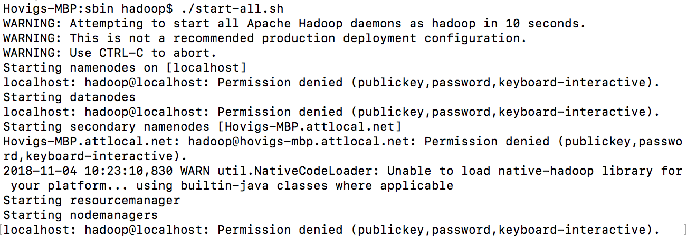
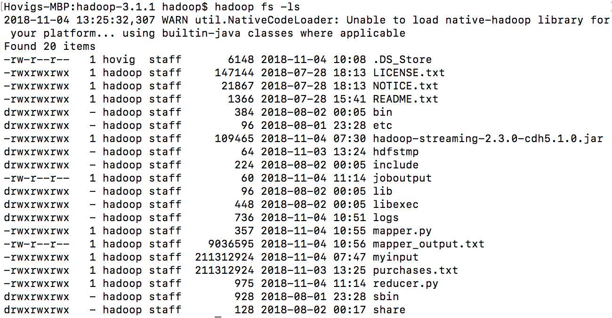

## Mapreduce

MapReduce relies on `<key, value>` pairs when mapping. Every move from previous key to the new key is considered a single unique instance of an updated value from its previous state to a new state, reliance will be on the cumulative value.

```javascript
inputFile -> map()<k_origin, v_origin> -> combine()<k_next, value_next> -> reduce()<k_final, v_final> -> outputFile
```

> Unzip purchases.txt and use it as an input file for the mapper.

Because of the permission issues that I spent time figuring it out and it requires core security changes for `.ssh` folder path permissions:

<hr>



<hr>

I ran the scripts local to Hadoop directory. Instead of feeding the data file to the `mapper.py`, I had to change `sys.stdin` and had to open input file within and write results to file as an output.

```bash
hadoop jar hadoop-streaming-2.3.0-cdh5.1.0.jar -input myinput -output joboutput -mapper mapper.py -reducer reducer.py -file mapper.py -file reducer.py

OR

cat purchases.txt | python mapper.py | sort -o mapper_output.txt mapper_output.txt | python reducer.py
```

With the same efficiency, mapping/sorting/reducing taking place when running `python mapper.py` and `python reducer` with the difference of instead of relying on the key to retrieve the final, the scripts will store the results separately and take actions on them. Check out the output:

`Toys Total = 57463477.11`
`Consumer Electronics = 57452374.13`

<hr>


